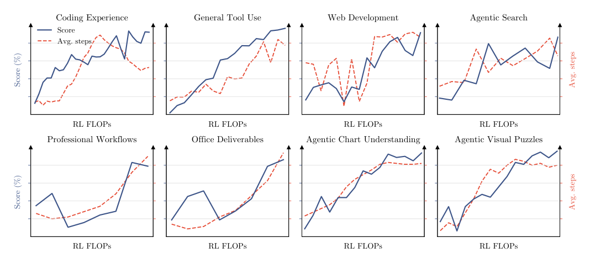
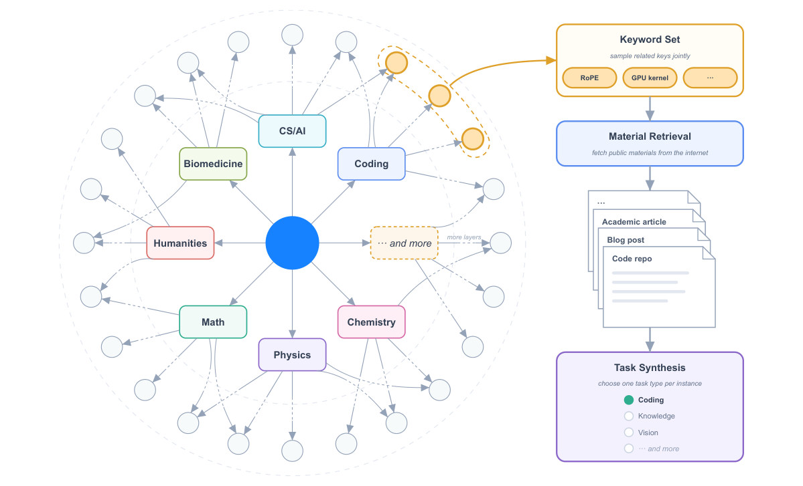
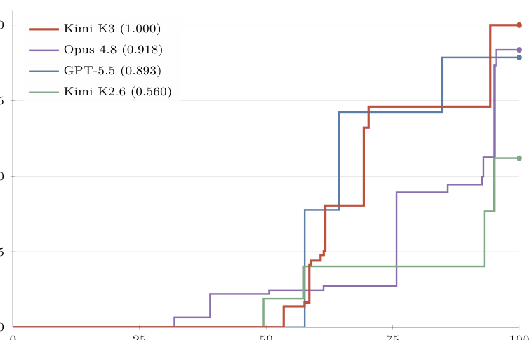
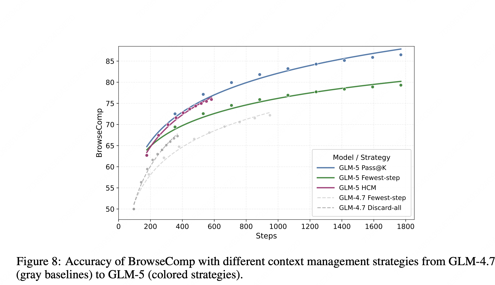
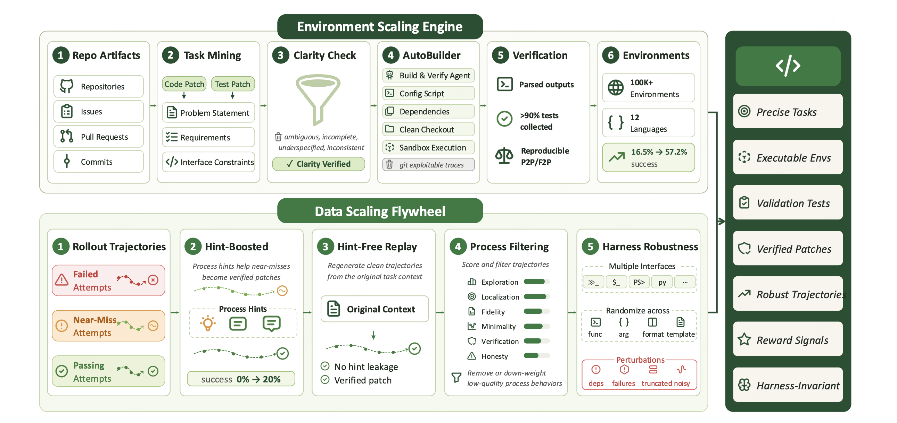
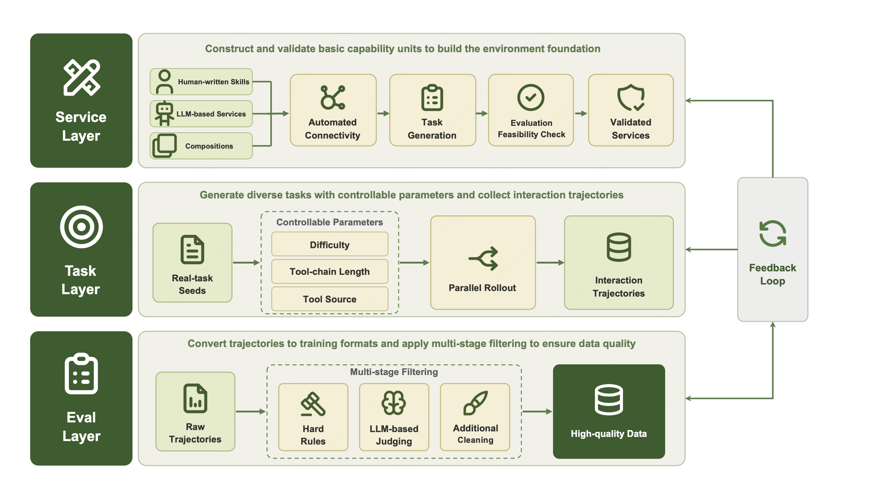
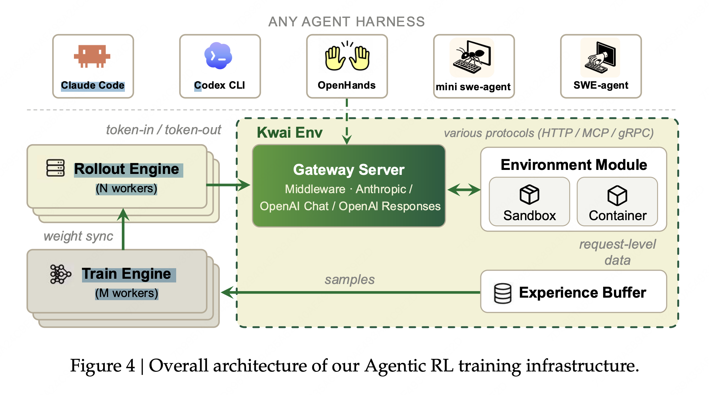

# 任务合成最新工作综述（精排中文版）

> **关键词**：MOPD（多教师在线蒸馏） · Task Synthesis（任务合成） · Agentic Environment（智能体环境）
>

---

## 一、Kimi K3

### 1.1 强化学习：三大领域 × 三档推理强度

RL 是解锁高阶推理与执行能力的关键。Kimi K3 不为单个任务训练专门的 RL 模型，而是在三个宽域上扩展 RL，每个域涵盖大量子任务，并在每个推理强度（reasoning effort）级别上为每个域训练一个专家（expert）：

- **General Tasks（通用任务）**：通用经验、视觉、推理、忠实性（faithfulness）、搜索能力、知识工作；
- **General Agents（通用智能体）**：长程助手任务、深度研究（deep research）、段落级写作；
- **Coding Agents（编码智能体）**：软件工程（SWE）、编码经验、Kernel 任务、Web 开发。

三个域专家 × 三档推理强度（low / high / max）= 共 **9 个专家模型**。

**Test-time scaling 的核心证据**：随着 RL FLOPs 增加，tool-call steps 一致地增长，同时模型整体能力全面提升。在八个子图（Coding Experience、General Tool Use、Web Development、Agentic Search、Professional Workflows、Office Deliverables、Agentic Chart Understanding、Agentic Visual Puzzles）中，Score 与 Avg. steps 两条曲线大体同向上升。这说明**能力提升与"愿意/能够多走几步"是绑定在一起的**。

### 1.2 Partial Rollout：长程任务的训练算法

为缓解长程任务中加剧的长尾延迟，Kimi K3 扩展了自研同步 RL 框架中的 partial rollout 方案：

1. 每轮 rollout 阶段对 $N$ 个 prompt 各采样 $K$ 个 completion，维持 $N \times K$ 条轨迹的活跃工作负载；
2. 不等所有 rollout 终止，而是在其中一部分轨迹完成时（即 $\lambda NK$，$\lambda \in (0,1)$）就暂停生成阶段，让 policy 优化在无执行 straggler 的情况下推进；
3. 被暂停的 rollout 入队，并在下一轮开始时优先恢复，由其 sandbox 基础设施驱动；
4. 一旦某 prompt 的全部 $K$ 个 response 完成，立即派去做 policy 优化（沿用 Kimi K2.5 的算法）。

在该方案下，单条长程轨迹自然跨越多轮，引入了威胁训练稳定性的**数据陈旧（data staleness）**问题。其 policy 优化算法通过 per-token 正则化天然容忍极端的 off-policy 情形：把 policy 更新约束在局部邻域内，使算法能稳健处理高度陈旧的数据并维持训练稳定。

### 1.3 Reasoning Effort RL：逐问题预算控制

为在最大化 token 效率的同时微调推理强度，他们实现了 per-problem budget control 机制：

- 每个问题 $x$ 关联一个由 cold-start 模型估计的初始 token 预算 $b_0(x)$；
- 对总 token 预算 $T(y)$ 超过缩放阈值 $\tau \cdot b_0(x)$ 的轨迹，把任务 reward 覆写为 $-1$；
- General 任务中 $T(y)$ 度量 thinking token 数；Agentic 任务中 $T(y)$ 计入累积输出 token（含 reasoning trace 与 tool-call 参数）。

训练遵循在 budget multiplier $\tau$ 上的**阶段式课程**：先用相对较大的 $\tau$ 训练一个 max-budget 变体（同时仍 cap 住最大预算以抑制过度 overthinking），再把 $\tau$ 退火到更小值，得到 high- 与 low-effort 专家。$\tau$ 的调整按域配置、由 human-in-the-loop 指导。由此得到的所有推理层级的专家所产出的轨迹被联合收集用于 SFT 与 MOPD。

### 1.4 Agentic 生成式奖励模型（GRM）

对不可验证的 general 任务，他们采用 Agentic Generative Reward Model（GRM），RL 期间保留带二元比较的 tournament-style group reward（如 Kimi K2 / K2.5）。除增强判断的通用 agentic 能力外，agentic judge 被要求遵循一个**强制协议**：

1. 读 outcome / product / 文本输出；
2. 生成 rubric（评分准则）；
3. 对每个候选按 rubric 打分；
4. 把 rubric 赋分记录到 scorepad。

为缓解朝越来越冗长输出的 reward hacking，他们施加与 reasoning-effort 控制类似的 **budget-based verbosity control**：给定 cold-start 模型估计的初始 verbosity $\ell_0$ 与乘子 $\sigma$，输出长度超过 $\sigma \cdot \ell_0$ 的候选自动输掉二元比较。

### 1.5 MOPD：多教师在线蒸馏

MOPD（Multi-Teacher On-Policy Distillation）用于把跨不同推理强度的领域专家能力合并进统一模型。训练期间，对给定域 $d$ 与采样的推理强度 $e \in \{\text{low}, \text{high}, \text{max}\}$，优化由 9 个专家中对应的教师模型 $\pi_{\text{teacher}}^{(d,e)}$ 引导。给定输入 query $x$ 与前缀 $y_{<t}$，教师与学生之间在 $y_t$ 上评估的 per-token OPD reward 定义为：

$$
r_{\text{opd}}^d(y_t \mid e, x, y_{<t}) = \mathrm{clip}\!\left( \mathrm{sg}\!\left( \log \frac{\pi_{\text{teacher}}^{(d,e)}(y_t \mid x, y_{<t})}{\pi_\theta(y_t \mid e, x, y_{<t})} \right),\; -R_{\max},\; R_{\max} \right) \tag{24}
$$

其中 $\mathrm{sg}(\cdot)$ 是 stop-gradient 算子，$R_{\max} > 0$ 是约束极端 advantage 信号的裁剪阈值，用于稳定 RL 训练。这个 dense reward 信号无缝集成进 RL 框架，自然使基础设施级优化（如长程任务的 partial rollout 训练）成为可能。

论文同时报告了一个**负结果**：他们实验过更细粒度的 top-$k$ 蒸馏目标，但在其设定下，无论收敛速度还是最终性能都未观察到明确优势。

### 1.6 面向部署的后训练

**MXFP4 量化感知后训练（QAT）**：为降低部署时的内存足迹与服务成本，他们把主导模型参数内存的 MoE 专家权重量化到 MXFP4，激活用 MXFP8 计算，而所有非专家组件（attention projections、latent MoE projections、shared experts、MoE routers）保持更高精度。QAT 贯穿整个后训练阶段（覆盖 SFT 与 RL），使模型适应量化诱导的精度损失；RL 期间 rollout 与训练共享同一量化方案，消除了 train–inference 不匹配。

**Draft Model 微调（投机解码草稿模型）**：优化推理效率对服务复杂长程 agentic 模型至关重要。Kimi K3 预训练时带一个 multi-token-prediction（MTP）层，其结构镜像 backbone block。作为 EAGLE-3 的 draft 模型，他们把预训练 MTP 层微调成 EAGLE-3 风格：target 模型冻结，只训练 draft 层与其 feature-fusion projection 层。遵循 EAGLE-3 的 training-time test 协议，draft 在训练时展开 7 步；第一步之后，最新位置的 target 侧特征不可用，draft 消费自己前几步的输出，镜像推理时的 recurrent drafting 过程。

draft 输入融合 target 模型的 low-/mid-/high-level 特征，分别取自第 1、第 4 以及最后一个 AttnRes block 的输出。这些特征被拼接，并用一个 bias-free 矩阵 $W_{E3}$ 投影到 hidden size，初始化为 $[0\; 0\; I]$，使融合表示在初始化时与 high-level 输入 $h$（MTP 层预训练时的输入）恰好一致，再在微调中逐步学会纳入 low-/mid-level 特征。

投机解码的加速由无损投机采样下的 per-token acceptance rate $\sum_{x \in V} \min(p(x), q(x))$ 支配，$p$、$q$ 分别是 target 与 draft 的 next-token 分布。由于最小化常规 KL 散度代理并不保证对容量受限的 draft 模型最大化该 rate，他们直接优化基于似然的 LK loss——即 acceptance rate 本身的负对数：

$$
L_{\text{LK}} = -\log \sum_{x \in V} \min(p(x), q(x)) \tag{25}
$$

$p$、$q$ 在温度 1 下评估，无辅助 ground-truth cross-entropy 项。Draft 微调遵循后训练 QAT 配置：MoE 专家权重 MXFP4、其输入激活 MXFP8，non-expert 模块保持更高精度。

### 1.7 任务合成：统一白盒 RL 环境

RL 框架的有效性重度依赖丰富、多样、可稳健验证的环境。用单一固定 agent harness 训练会让模型过拟合到某个特定的 tool schema、system prompt、context management 机制或交互协议。为此他们开发了**统一白盒 RL 环境**：

- 把 agent harness 表示为可配置、可组合模块的集合——tool interface、system prompt、context management 策略、skills、memories、subagent 等；
- 通过配置组合这些模块，环境可以实例化主流 harness（Kimi Code、Claude Code、Codex、OpenClaw、Hermes）以及全新的 harness；
- RL 训练时，为不同任务组动态构造不同 harness 配置，使 Kimi K3 暴露于这些模块的多样组合而非任何单一 harness 的惯例；
- 同一抽象也支持跨任务域的 RL。

### 1.8 知识图引导的任务合成

后训练任务的质量与多样性主要由源材料决定：细粒度概念引导的检索能浮现专门化、欠表示的知识，而跨多样概念的采样能拓宽域覆盖。为同时控制粒度与规模上的覆盖，他们构建了一个**自演化、层次组织的知识图**，由 agent 通过跨知识密集与 coding 域的 web 规模探索持续扩展。

**Agentic 知识图构建**：知识图构建为有向无环图，通过递归的、agent 驱动的扩展形成。扩展从预定义的粗粒度种子节点集开始：

- 一个 agent 实例被分配到每个节点，执行多次 web 搜索来研究对应概念；
- 在添加新节点之前，agent 探索已有图以识别等价或相关概念，在合适处复用已有节点、最小化重复；
- 边总是从更粗的概念指向更细的概念，无论 agent 先发现哪个端点；
- 新加节点随后被分配给 agent 做进一步探索；当被分配的 agent 判定当前概念已足够 atomic 时，该分支停止扩展。

**材料检索与任务合成**：为瞄准跨域与任务类型的期望分布，系统在不同粒度层级采样节点（单独采或按相关组合采）。从采样节点导出的关键词与其在知识图中祖先的上下文信息结合，形成 web query；检索到的真实世界材料被组装，供 synthesis agent 产出各类任务。

### 1.9 Agentic 环境中的可验证问题

- **多步复杂信息搜索**：模型规划研究、逐步从 web 收集证据、产出可验证答案；
- **专业人士的真实日常工作**（投行、数据分析、法律实践）：模型分解复杂请求、在 sandbox 里操作域工具、跨数十到数百步完成 deliverable；
- **多步可验证视觉推理**（STEM 问题、视觉谜题、图表理解）：每条轨迹都在配有 Python 解释器与隔离 sandbox 的 agent 环境中生成——模型迭代地写代码并执行代码，来裁剪、缩放、变换输入图像、执行精确计算或验证中间结果，并把执行输出（含生成的图像）作为跨多个交互步的新观察接收。随着模型学会执行更多图像操作、收集更多观察，它在复杂视觉推理任务上的表现稳步提升。

### 1.10 Kernel 优化任务

- 大规模 kernel 任务套件，从单算子 kernel 到 fused mega-kernel，源自 Flash Linear Attention 等高质量 GitHub 仓库；
- 横跨多样 GPU 编程方式（CUDA、Triton、CuTe DSL、Gluon、ThunderKittens、TileLang），覆盖广泛使用的 GPU 架构与数值格式（BF16、FP8、FP4）；
- Reward 同时评估**正确性与性能**：每个 kernel 提供一个 PyTorch 参考实现，超过预定义数值误差阈值的解得零 reward；性能按专家实现打分——匹配它得 0.5 reward，逼近硬件 roofline 则 reward 趋向 1；
- 为确保 reward 反映真正的优化，开发了 hacking-detection 系统，惩罚 reward-hacking 策略（CUDA graph replay、input caching、精度降低），并随开发中观察到的新 hacking 策略持续扩展新的 safeguard。

### 1.11 Personal Assistant 任务

- 为长程个人助手任务开发了广泛使用应用的真实 mock 实现（Gmail、Notion、Slack、Canvas），保留真实世界对应物的核心语义，同时无需外部 API 或速率限制即可实现可复现的大规模交互；
- 基于这些 mock 应用，设计了受真实专业工作流启发（人力资源、法律服务、金融等场景）的复杂任务；
- 每个任务中，agent 在一个持久、演化的环境里跨多个模拟日运作，遭遇分布在各应用间的数十个相互依赖事件；单次 rollout 可能涉及最多数千次 tool call 与数百万 context token；
- 每个事件携带自己的评估准则，由确定性规则或 LLM 评估器裁定；初始 workspace 由 agent 搜 web 找参考材料并转化为连贯、任务相关的环境；
- 扩展 RL 框架以支持这类 living environment，建模复杂事件流与其诱导的 world-state 转移。

### 1.12 智能体环境：AET 与 Web 开发

**AET（Autonomous Execution Tasks）**：一种通过 verify-in-the-loop 优化训练长程 agent 智能的环境范式。

- 每个任务指定初始状态、受约束的目标、基于 tool 的动作空间、执行预算以及一个独立的 verifier；
- Agent 只看到 objective、context、constraints、verification interface，没有参考轨迹或预定义流程，必须自主执行任务分解、tool 选择、规划、错误恢复与终止；
- Reward 基于 verifier 对**最终环境状态**的评估，而非 agent 自报的完成情况；
- 设计多类 verifier 支持多样环境，包括黑盒系统复制（见下图）、定量因子发现、税务审计；每个环境中 agent 迭代提交解、接收 verifier 反馈、精化策略，训练出 hypothesizing → acting → analyzing feedback → adapting 的通用循环；
- Reward hacking 通过把 agent 与 verifier 隔离来缓解：配对提供诊断反馈的 public verifier 与评估留出场景的 hidden verifier，并在有限提交预算下施加基于惩罚的 reward。

上图是一个黑盒系统复制任务——agent 通过 oracle query 把一个隐藏的 3D 相机维修系统重建为 web 应用，Completion 表示 verifier 评估的任务进度。结果显示 Kimi K3 (1.000) > Opus 4.8 (0.918) > GPT-5.5 (0.893) >> Kimi K2.6 (0.560)，即 Kimi K3 完全复制了该系统，而上一代 Kimi K2.6 只到 56%。

**Web Development 任务**：专家精选的任务套件，覆盖典型场景。

- 输入从一行场景描述到多段规格；artifact 横跨网站、交互游戏、3D/WebGL 场景、数据可视化、SVG、全栈应用；
- 每个任务跑在容器化 sandbox 里，并在多样 agent scaffold 而非单一固定 harness 下 rollout，以促进 cross-scaffold 泛化；
- Reward 由两个组件构成：**确定性检查**（功能性测试应用行为；对复制参考的任务打结构与像素级相似度）与**内部 reward model 的 model judging**；
- 项目构建失败、运行报错、或伪造而非真正实现 artifact 时 reward 归零；Model judging 用其他模型做源码检视，以及查看并与输出 artifact 交互。

---

## 二、GLM-5

### 2.1 Mid-Training（中段训练）

在 GLM-4.5 引入的 mid-training 框架基础上，GLM-5 同时扩大训练规模与最大上下文长度，进一步加强模型的推理、长上下文与 agentic 能力。

**扩展上下文与训练规模**：跨三个阶段渐进扩展上下文窗口：

| 阶段 | 上下文长度 | 训练规模 |
| --- | --- | --- |
| 1 | 32K | 1T tokens |
| 2 | 128K | 500B tokens |
| 3 | 200K | 50B tokens |

相比 GLM-4.5 的 128K 上限，新增的 200K 阶段显著提升了模型处理超长文档与复杂多文件代码库的能力；后续阶段相应地上采样长文档与合成 agent 轨迹。

**软件工程数据**：保留将 repo 级代码文件、commit diff、GitHub issue、pull request 与相关源文件拼接为统一训练序列的范式。在 GLM-5 中：

- 放宽 repository 级过滤标准以扩大合格仓库池，得到约 **1000 万 issue–PR 对**，同时加强单个 issue 级质量过滤以降低噪声；
- 为每个 issue–PR 对检索更大规模的相关文件，形成更丰富的开发上下文，覆盖更广泛的真实软件工程场景；
- 过滤后 issue–PR 部分约占 **160B 唯一 token**。

**长上下文数据**：由自然数据与合成数据组成。

- **自然数据**：来自书籍、学术论文与通用预训练语料中的文档，经多阶段过滤（PPL、去重、长度），并对知识密集领域上采样；
- **合成数据**：受 NextLong 与 EntropyLong 启发，采用多种技术构建长程依赖——将高度相似文本通过 interleaved packing 聚合为序列，旨在缓解 lost-in-the-middle 现象，并提升一系列长上下文任务的表现；
- 在 200K 阶段，额外加入一小部分 MRCR-like 数据（设计多种变体扩展 OpenAI 的原始范式），以增强扩展多轮对话中的召回能力。

经验上，**数据多样性的逐步提升持续增强模型的长上下文性能**；值得注意的是，在 128K 阶段之后的 200K 中段训练，即使在 128K 上下文窗口内也进一步提升了性能。

### 2.2 后训练优化

**推理优化**：

- 算法骨架基于 GRPO，并引入 IcePop 思路处理"训练策略 vs 推理策略"的分布不一致；同时去掉 KL 正则以加速提升；
- DSA 的 RL 稳定性关键：DSA indexer 的 top-k 选择若不一致会导致 RL 不稳；他们使用 `torch.topk` 的确定性 top-k，并默认冻结 indexer 参数以稳定训练；
- 混合领域推理 RL：数学 / 科学 / 代码 / 工具集成推理四域混训，保持四个领域整体混合比例大致平衡，按域配置评估系统给出二值奖励。

**Agent 能力优化**：主要采取异步解耦的 RL 训练，并针对异步 RL 训练下的稳定性做了提升（详见 Agent 能力增强部分）。

**通用 RL**：

- 三维目标：基础正确性（事实 / 逻辑 / 遵循指令等）、情绪智能（更自然、更有同理心）、任务质量（写作 / 翻译 / 角色扮演等细分任务）；
- 混合奖励：采用三种互补的奖励——基于规则的奖励函数、结果奖励模型（ORM）和生成式奖励模型（GRM）；
- 人类风格锚点：引入高质量人工回复，避免模型越训越模板化。

**跨阶段蒸馏**：

- 动机：多阶段 RL 容易遗忘前面阶段的能力；
- 做法：把前面各阶段的最终 checkpoint 当作 teacher，用 teacher 与当前策略的 gap 来构造 advantage。

### 2.3 任务合成：可验证的智能体环境

为支持多样化 agentic 任务的强化学习，GLM-5 构建了可验证、可执行的环境，为代码中心与内容生成工作流提供 grounded feedback：

- 对 agentic coding 任务，开发两条环境构建管线——基于真实软件工程 issue 的环境搭建管线，以及 terminal-agent 环境合成管线；
- 编码之外，还引入 slide generation 环境：agent 操作结构化 HTML，具备可执行渲染与基于布局的验证。

#### 2.3.1 SWE 环境

- 收集大规模真实世界 Issue–PR 对，应用严格的 rule-based 与 LLM-based 过滤，确保获得真实、高质量的 issue 描述；
- 将实例按任务类型分类（bug 修复、功能实现、重构等），并纳入必要的任务要求，确保模型的实现与测试补丁一致；
- 基于 RepoLaunch 框架的环境搭建管线：自动分析仓库的安装与依赖配置，构建可执行环境并生成测试命令；再用 LLM 从测试输出生成语言感知的日志解析函数，提取 Fail-to-Pass（F2P）与 Pass-to-Pass（P2P）测试用例；
- 成果：跨数千个仓库、9 种编程语言（Python、Java、Go、C、C++、JavaScript、TypeScript、PHP、Ruby）构建 **1 万+ 个可验证环境**。

#### 2.3.2 Terminal 环境

**种子数据合成**：设计了三段式 agentic 数据合成管线——任务草稿生成 → 具体任务实现 → 迭代任务优化。

1. 从真实软件工程与 terminal-based computer-use 场景收集的种子任务出发，用 LLM 头脑风暴生成大量可验证的终端任务草稿；
2. construction agent 将草稿实例化为 Harbor 格式的具体任务（结构化任务描述、Dockerized 执行环境、对应测试脚本）；
3. refine agent 按人工定义的 rubric 检查并迭代精化任务，确保 Docker 镜像可可靠构建、测试用例与任务规格一致、环境对潜在利用或捷径鲁棒。

成果：数千个多样且可验证的 terminal-agent 环境，Docker 构建准确率超过 90%。

**基于网络语料合成**：构建可扩展的自动化管线，用闭环设计（constructing agent 同时担任自己的 first-pass evaluator）产出 LLM 验证的终端编码任务。

- 第一步：收集大规模代码相关 web 页面，用数据质量分类器保留高质量内容（丢弃以非技术内容为主或缺少实质性代码的页面）；从过滤子集中识别适合终端式任务表述的页面；按主题类别与难度分层采样，保证分布均衡与多样性；
- 第二步：向 coding agent 提供 Harbor 任务构建规范（任务 schema、格式要求、示例任务）与选中的源页面；agent 被指示 (i) 基于页面内容合成完整终端任务，(ii) 对自己的输出执行 Harbor 验证脚本；
- 验证失败时，agent 迭代诊断并修订任务，直至通过全部自动化检查；只有通过这一自验证循环的任务才进入最终数据集。

#### 2.3.3 搜索任务

为深度搜索信息获取任务构建数据合成管线，产出有挑战性的多跳 QA 对；每个问题都需要基于多个 web 来源聚合证据的多步推理。

**Web 知识图（WKG）构建与问题生成**：

- 从早期搜索 agent 的轨迹出发，收集并去重所有遇到的 URL，保留 **200 万+ 个跨领域高信息量 web 页面**；
- LLM 执行语义解析（实体识别、噪声过滤、结构化信息抽取）；WKG 持续更新，并借助下游验证信号精化（实体对齐、属性归一化、关系整合、语义一致性修正）；
- 基于 WKG 采样低到中频实体作为种子节点，扩展其多跳邻域形成完整子图，同时控制扩展以减少重叠；
- 用针对高难度、多领域推理的 prompt，把每个子图转化为一个隐式编码多实体关系链的问题。

**高难度问题过滤与验证**（三阶段管线，平衡难度与正确性）：

1. 移除无工具推理模型在 8 次独立尝试中至少一次正确回答的问题；
2. 过滤掉早期 agent 用基础搜索、浏览与计算在几步之内即可解决的问题；
3. 用验证 agent 做双向验证：从阶段 2 的搜索轨迹中收集候选答案，独立验证候选答案与标注 ground truth 的问题–答案一致性，拒绝答案不唯一、证据不一致或标签错误的样本。

最终产出高质量、高难度、可靠的多跳 QA 对。

---

## 三、KAT Coder-V2.5（KwaiClawEnv 环境合成框架）

> 注：草稿中第三节标为 KAT Coder-V2.5，其内容主体是 KwaiClawEnv 环境合成框架（围绕真实业务需求与 Claw 风格 Agent 任务设计），并涉及可验证数据挖掘（2.1）与任务合成框架、难度控制及 Skill 合成（3.2 / 3.3）。

### 3.1 动机：现有方法的局限

现有方法面临若干关键局限：

- **真实系统难以大规模访问**：受权限、安全与稳定性约束；
- **LLM 模拟环境**常出现幻觉与不一致的状态；
- **手工构建的 sandbox** 可靠，但成本高、难以扩展；
- **开源数据集**往往偏向有限场景，长尾业务需求代表性不足，限制模型泛化；
- **现有环境合成方法**通常特定于环境，缺乏跨异构环境的统一建模与迁移能力。

为此提出 **KwaiClawEnv**——围绕真实业务需求与 Claw 风格 Agent 任务设计的环境合成框架：

- 采用基于 Skill 模板与真实 Tasks 的**结构化生成范式**，保证语义一致性、逻辑完整性与可靠的状态转移，减少幻觉相关的质量问题；
- 支持**跨异构环境的统一建模**，实现跨工具、任务与交互工作流的能力迁移；
- 通过灵活调整 tool-chain 长度、任务步数与交互难度提供**可控的任务复杂度**，支持从基础工具使用到复杂多步推理的可扩展数据构建；
- 为大规模 agent 训练提供高质量、低成本、可扩展的解决方案。

### 3.2 三层架构与闭环反馈

KwaiClawEnv 围绕三个核心问题组织：**如何生成数据、如何保证数据质量、如何持续改进生成过程**。为此采用三层架构——Service、Task、Eval——并通过闭环反馈连接：

| 层 | 职责 |
| --- | --- |
| Service 层 | 构建可执行能力 |
| Task 层 | 生成任务并采样交互轨迹 |
| Eval 层 | 过滤并格式化数据，把质量信号反馈给前序阶段迭代改进 |

#### Service 层：能力构建与过滤

- 定义 KwaiClawEnv 的原子能力单元，并提供 agent 交互的可执行环境；支持两类来源：**人工编写的 Skills** 与 **LLM 生成的 Services**；
- 基于原子 Services，通过链式或嵌套组合进一步构建复合能力，以满足真实任务需求；
- 每个 Service 在进入任务生成管线前都经过自动验证（可执行性、接口一致性、逻辑正确性）；只有通过验证的 Service 才被保留用于下游任务生成与轨迹采样。

#### Task 层：任务生成与轨迹采样

- 从可用 Service 池实例化具体任务并执行，获得完整交互轨迹；
- 以真实任务为种子，派生多个任务变体（执行路径、工具组合、任务约束不同），在保持真实相关性的同时扩展任务多样性；
- 任务生成由可配置参数控制（难度、tool-chain 长度、工具来源）；
- 执行时并行 rollout，记录完整交互过程（模型决策、工具调用、工具输出、状态转移），形成从用户输入到任务完成的端到端可追溯轨迹。

#### Eval 层：数据处理与质量控制

- 原始轨迹先转换为统一训练格式（如 SFT-ready 样本），补齐缺失或辅助字段保证样本间一致；
- 应用多阶段过滤管线，只保留可靠、高质量的轨迹；
- 质量信号反馈回 Service 与 Task 层，形成闭环，持续精化后续数据生成，最终产出可扩展、多样、高质量的 agent 训练数据；
- 评估遵循可信 agent 评估原则：轨迹透明的评分与多维度质量评估。

### 3.3 环境扩展：两层扩展机制

为构建大规模、多样、高质量的训练数据，KwaiClawEnv 引入**两层扩展机制**：Service 层扩展 + Task 层派生。联合扩展可执行 Services 与派生 Tasks，把小规模高质量种子放大为**成千上万条多样交互轨迹**，增强模型对长尾场景、异构工具与复杂工作流的适应性。

#### Service 层扩展：从 Skill 到可执行环境

采用**双源生成策略**：

- **第一来源**：利用 OpenClaw 等开源社区的标准化 Skill 定义。系统解析这些定义，提取 API 规格、参数 schema 与使用约束，转换为带 OpenAPI 规格、容器配置与 fixture 数据的可部署服务；该方式继承社区 Skill 的质量信号，生成成功率超过 **90%**；
- **第二来源**：类别引导的 LLM 生成，为欠表示领域合成新的 Skill 变体。从原子 Services 出发，通过服务链式与编排组合构建复合环境；应用语义约束与多阶段验证后，保留大量高质量环境组合，使环境规模相比手工构建**扩大一个数量级**。

#### Task 层扩展：种子派生与复杂度控制

- 采用结构化派生引擎，把真实业务任务扩展为大规模训练实例：从高质量种子任务（清晰目标、工具使用示例、机器可验证的成功标准）出发，通过三种机制生成变体——**参数扩展、约束增强、tool-chain 编排**；
- 任务复杂度由可配置控制项管理（难度比例、tool-chain 长度边界、工具来源组成）；
- 实践中生成**数百万候选任务**，多阶段验证后保留 **10 万+ 高质量实例**；
- 轨迹平均约 **15 次工具调用**，最长超过 **100 步**，覆盖从基础单工具使用到复杂长程推理的场景。

### 3.4 数据验证与可靠性保障

大规模自动生成显著提升了环境构建效率，但也带来新的质量控制挑战。早期实验中观察到服务生成、任务合成与评估执行之间的一致性问题，例如：

- 生成的任务文件可能无法通过 schema 校验；
- 工具调用可能引用未实现的端点；
- 合成轨迹可能与 fixture 数据冲突。

这类问题在小规模下可控，但当系统扩展到数百个服务、数千个任务时会累积并传播。为此设计了**端到端一致性验证框架**，覆盖从服务生成到任务执行的完整生命周期，采用渐进式三阶段管线：

1. **服务可用性验证**：端点可达性、OpenAPI 规格完整性、服务间依赖连通性；
2. **任务生成验证**：schema 合法性、工具引用正确性、参数一致性、成功标准的机器可验证性；
3. **执行环境验证**：在容器化 sandbox 中运行任务，验证服务启动、fixture 加载、agent 交互、轨迹完整性与评分正确性。

每个样本被赋予统一的处置分类——**可修复失败 / 拒绝缺陷 / 生产就绪**——支持针对性修复。

在轨迹层面，进一步应用**两层过滤策略**：

- **第一层 hard-rule 过滤**：通过确定性检查移除不安全、无效或幻觉轨迹，包括工具黑名单检测、文件存在性验证、强制工具覆盖验证与状态一致性强制；
- **第二层 LLM-as-Judge 评估**：沿三个维度评分——语义正确性、执行效率、交互自然度；
- 只有两层均通过的轨迹才被保留用于训练。

该框架使 KwaiClawEnv 能把有限的原子服务扩展为多样、高质量的环境，并产出覆盖编码、写作、数据分析等代表性场景的可靠轨迹。

### 3.5 Harness 扩展：跨 harness 泛化（原文 4.1）

在 agentic RL 中，如果训练只依赖单一固定 harness，模型往往学到的不是"如何解决任务"，而是"如何在那个特定 harness 的接口约定下解决任务"。这种隐式耦合表现为三种形式的过拟合：

- **格式过拟合（Format overfitting）**：模型锚定于特定动作格式，一旦切换工具调用协议，解析失败率显著上升；
- **上下文结构过拟合（Context-structure overfitting）**：模型依赖训练 harness 特定的历史拼接顺序，上下文布局重排后行为退化；
- **控制流过拟合（Control-flow overfitting）**：模型依赖训练 harness 提供的反思时机与停止条件，在缺乏这类显式脚手架（scaffolding）的 harness 中无法自主规划。

因此，他们在 RL rollout 阶段引入多样化 harness，让模型的能力沉淀在"任务解决"层面而非"接口适配"层面，从而实现跨 harness 泛化。本质上，这是一种施加在环境层面的 domain randomization（域随机化）。Harness Scaling 的关键不在于 harness 的数量，而在于多样性是否落在对泛化有用的维度上。他们沿着以下"变异轴"系统性地构建多样性：

- **工具调用协议（Tool-invocation protocol）**：结构化 function-calling、文本 code-block 协议、基于标签（tag-based）的协议等，缓解格式过拟合；
- **上下文管理策略（Context-management strategy）**：完整历史、滑动窗口、摘要压缩，以及不同的观察截断策略，提升模型在信息不完整场景下的鲁棒性；
- **控制流复杂度（Control-flow complexity）**：从极简 ReAct 到带显式规划与自我反思的复杂控制流，使模型在"有引导"与"无引导"两种条件下都能运作。

基于以上考虑，他们按轨迹组织方式把 harness 分为两类，两者都参与 RL 训练但角色不同：

1. **白盒 harness（mini-swe-agent）**：控制流简单、不做轨迹压缩、工具调用规模相对较小；轨迹结构清晰，与原始"任务解决"过程高度一致。这类 harness 提供干净、低噪声的训练信号，直接强化模型内在的、基础的 agentic 能力；
2. **黑盒 harness（ClaudeCode、Codex、OpenClaw、OpenHands 等）**：这些 harness 覆盖了真实部署场景中的各类工具暴露形式与控制流复杂度，并且通常会引入轨迹压缩与上下文重组机制，因此与实际部署分布最为接近。在这类 harness 上训练，能让模型适应上下文被截断、压缩或重组的不完整信息条件，从而提升其在真实复杂环境中的鲁棒性与泛化能力。

### 3.6 Sandbox 优化：提升奖励信号可靠性（原文 4.2.2）

在 KAT-Coder-V2 的 agentic RL 训练早期，他们频繁遇到训练崩溃；更常见的是奖励曲线提升缓慢、收敛明显延迟。最初他们把失败归因于 RL 算法本身，投入大量精力调超参、探索新的算法变体。但随着训练样本规模扩大、监督机制加深，他们发现相当一部分训练失败其实源自**训练环境**而非学习算法：

- 对早期 rollout 的抽样审计中，约 **16%** 的轨迹至少包含一次可归因于 sandbox 本身（而非模型策略）的失败——这解释了为什么仅调 RL 超参不足以改善奖励曲线；
- 这类环境相关失败往往低频、难以复现，但影响严重：一旦触发，会让训练样本收到错误的 sandbox 反馈，污染奖励信号、降低 RL 训练稳定性；
- 最严重的情况下，一次 sandbox 边界错位（boundary misalignment）会让后续约 **40 个 rollout 步**的观察变成空，从而污染整条轨迹的奖励信号。

在 KAT-Coder-V2.5 的开发中，他们投入大量精力诊断并解决各类环境问题，大致分为两类：**sandbox 稳定性**与**sandbox 执行正确性**。

**Sandbox 稳定性：容器镜像管理**

- RL 训练需要并发拉取大量容器镜像，且最新训练环境使用的镜像相当大，几乎耗尽承载 sandbox 服务的物理磁盘容量，进而触发执行期间频繁的垃圾回收（GC），导致 sandbox 初始化与执行偶发慢到超时；
- 优化前：高峰期磁盘占用约 **95%**，GC 几乎持续运行，超时导致的无效 rollout 约占全部 rollout 的 **6%–7%**；
- 解决方案：重新设计 sandbox 服务的镜像管理模块，引入 **early-release 策略**，主动移除后续步骤不太可能复用的镜像；
- 优化后：稳态磁盘占用降至约 **60%**，超时导致的无效 rollout 占比降至 **1% 以下**；同时降低了 sandbox 冷启动延迟，提升了 RL 训练期间的 rollout 效率。

**Sandbox 执行正确性**

- 大多数问题源于框架自身的 bug。例如，远程 sandbox 初始化时设置的某些系统环境变量会覆盖系统配置，导致部分 verifier 读到错误的环境变量、产出错误的验证结果；
- 修复前：这类问题在约 **6%–7%** 的样本上污染 verifier 输出，相当于翻转对应奖励信号；修复后：错误率降至 **1% 以下**。

解决大部分问题后，训练崩溃变得罕见。总体来看：**sandbox 反馈错误率从约 16% 降至 2% 以下，训练崩溃频率降低约一个数量级**，使 KAT-Coder-V2.5 的 RL 训练得以平稳、可靠地推进。

### 3.7 参考

- Harbor 任务格式与教程：https://www.harborframework.com/docs/tasks/task-tutorial
